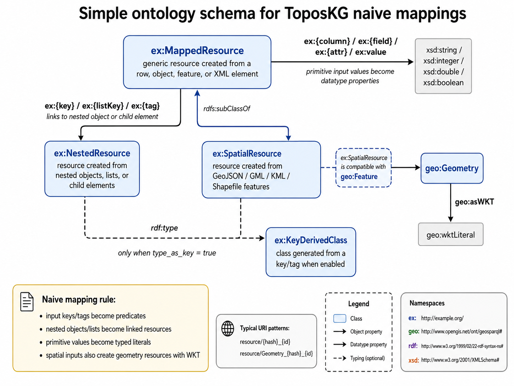

# Naive Mapping API



This page documents the public, user-facing classes for direct conversion of common input formats into RDF/N-Triples. These converters follow the same high-level pattern:

```python
converter = SomeConverter(input_file, out_file)
converter.parse(...)
converter.export()
```

---

## `CSVConverter` [source](https://github.com/KwtsPls/ToposKG/tree/main/toposkg_lib/toposkg/converter/toposkg_lib_csv_converter.py#L6)

```python
class CSVConverter(
    input_file,
    out_file,
    delimeter=",",
    ontology_uri="https://example.org/ontology/",
    resource_uri="https://example.org/resource/",
)
```

Naively converts a CSV file into RDF triples. Each row becomes an entity, and each CSV column becomes a predicate under `ontology_uri`.

### Parameters

| Parameter | Type | Default | Description |
|---|---:|---:|---|
| `input_file` | `str` | required | Path to the input CSV file. |
| `out_file` | `str` | required | Path where the generated N-Triples file will be written. |
| `delimeter` | `str` | `","` | CSV delimiter used by `csv.DictReader`. The implementation uses the spelling `delimeter`. |
| `ontology_uri` | `str` | `"https://example.org/ontology/"` | URI prefix used to construct predicates from CSV column names. |
| `resource_uri` | `str` | `"https://example.org/resource/"` | URI prefix used to construct generated subject URIs. |

### Methods

#### `CSVConverter.parse(id_columns=[], type_as_key=False)` [source](https://github.com/KwtsPls/ToposKG/tree/main/toposkg_lib/toposkg/converter/toposkg_lib_csv_converter.py#L18)

```python
parse(id_columns=[], type_as_key=False)
```

Parse the CSV file and populate `self.triples`.

| Parameter | Type | Default | Description |
|---|---:|---:|---|
| `id_columns` | `list[str]` | `[]` | Ordered list of CSV columns to use as row identifiers. The first available value is used. If no value is found, an incremental ID is generated. |
| `type_as_key` | `bool` | `False` | Accepted by the public signature for consistency with other converters. It is currently not used by `CSVConverter`. |

#### `CSVConverter.export()` [source](https://github.com/KwtsPls/ToposKG/tree/main/toposkg_lib/toposkg/converter/toposkg_lib_csv_converter.py#L60)

```python
export()
```

Write the parsed triples to `out_file` in N-Triples-like syntax.

### Example

```python
from toposkg.converter.toposkg_lib_csv_converter import CSVConverter

converter = CSVConverter(
    input_file="data/places.csv",
    out_file="out/places.nt",
    ontology_uri="https://example.org/ontology/",
    resource_uri="https://example.org/resource/",
)
converter.parse(id_columns=["id"])
converter.export()
```

---

## `JSONConverter` [source](https://github.com/KwtsPls/ToposKG/tree/main/toposkg_lib/toposkg/converter/toposkg_lib_json_converter.py#L7)

```python
class JSONConverter(
    input_file,
    out_file,
    ontology_uri="https://example.org/ontology/",
    resource_uri="https://example.org/resource/",
)
```

Naively converts JSON documents into RDF triples by recursively walking dictionaries and lists. Nested JSON objects can become linked resources, while literal values become typed RDF literals.

### Parameters

| Parameter | Type | Default | Description |
|---|---:|---:|---|
| `input_file` | `str` | required | Path to the input JSON file. |
| `out_file` | `str` | required | Path where the generated N-Triples file will be written. |
| `ontology_uri` | `str` | `"https://example.org/ontology/"` | URI prefix used to construct predicates and optional classes from JSON keys. |
| `resource_uri` | `str` | `"https://example.org/resource/"` | URI prefix used to construct generated subject URIs. |

### Methods

#### `JSONConverter.parse(id_fields=[], type_as_key=False)` [source](https://github.com/KwtsPls/ToposKG/tree/main/toposkg_lib/toposkg/converter/toposkg_lib_json_converter.py#L20)

```python
parse(id_fields=[], type_as_key=False)
```

Parse the JSON file and populate `self.triples`.

| Parameter | Type | Default | Description |
|---|---:|---:|---|
| `id_fields` | `list[str]` | `[]` | Ordered list of JSON keys to use as identifiers for generated resources. If no key is found, an incremental ID is generated. |
| `type_as_key` | `bool` | `False` | If `True`, nested objects receive an `rdf:type` triple using the JSON key as the class name. |

#### `JSONConverter.export()` [source](https://github.com/KwtsPls/ToposKG/tree/main/toposkg_lib/toposkg/converter/toposkg_lib_json_converter.py#L158)

```python
export()
```

Write the parsed triples to `out_file`.

### Example

```python
from toposkg.converter.toposkg_lib_json_converter import JSONConverter

converter = JSONConverter("data/places.json", "out/places.nt")
converter.parse(id_fields=["id"], type_as_key=True)
converter.export()
```

---

## `GeoJSONConverter` [source](https://github.com/KwtsPls/ToposKG/tree/main/toposkg_lib/toposkg/converter/toposkg_lib_geojson_converter.py#L9)

```python
class GeoJSONConverter(
    input_file,
    out_file,
    ontology_uri="https://example.org/ontology/",
    resource_uri="https://example.org/resource/",
)
```

Converts GeoJSON features into RDF triples. Feature properties are converted like JSON fields, and geometries are serialized as GeoSPARQL `geo:asWKT` literals connected through `geo:hasGeometry`.

### Parameters

| Parameter | Type | Default | Description |
|---|---:|---:|---|
| `input_file` | `str` | required | Path to the input GeoJSON file. |
| `out_file` | `str` | required | Path where the generated N-Triples file will be written. |
| `ontology_uri` | `str` | `"https://example.org/ontology/"` | URI prefix used to construct predicates from GeoJSON property names. |
| `resource_uri` | `str` | `"https://example.org/resource/"` | URI prefix used to construct feature and geometry URIs. |

### Methods

#### `GeoJSONConverter.parse(id_fields=[], type_as_key=False)` [source](https://github.com/KwtsPls/ToposKG/tree/main/toposkg_lib/toposkg/converter/toposkg_lib_geojson_converter.py#L29)

```python
parse(id_fields=[], type_as_key=False)
```

Parse all features in the GeoJSON file, create feature entities, add geometry triples, and populate `self.triples`.

| Parameter | Type | Default | Description |
|---|---:|---:|---|
| `id_fields` | `list[str]` | `[]` | Ordered list of property keys to use as feature identifiers. If none is found, an incremental ID is generated. |
| `type_as_key` | `bool` | `False` | Accepted by the public signature. The converter stores the flag internally for nested dictionary handling. |

#### `GeoJSONConverter.export()` [source](https://github.com/KwtsPls/ToposKG/tree/main/toposkg_lib/toposkg/converter/toposkg_lib_geojson_converter.py#L151)

```python
export()
```

Write the parsed feature, property, and geometry triples to `out_file`.

### Example

```python
from toposkg.converter.toposkg_lib_geojson_converter import GeoJSONConverter

converter = GeoJSONConverter("data/pois.geojson", "out/pois.nt")
converter.parse(id_fields=["osm_id"])
converter.export()
```

---

## `XMLConverter` [source](https://github.com/KwtsPls/ToposKG/tree/main/toposkg_lib/toposkg/converter/toposkg_lib_xml_converter.py#L5)

```python
class XMLConverter(
    input_file,
    out_file,
    ontology_uri="https://example.org/ontology/",
    resource_uri="https://example.org/resource/",
)
```

Naively converts XML trees into RDF triples. XML elements become generated resources, attributes become predicates, and element text becomes a `value` literal.

### Parameters

| Parameter | Type | Default | Description |
|---|---:|---:|---|
| `input_file` | `str` | required | Path to the input XML file. |
| `out_file` | `str` | required | Path where the generated N-Triples file will be written. |
| `ontology_uri` | `str` | `"https://example.org/ontology/"` | URI prefix used to construct predicates and optional classes from XML element/attribute names. |
| `resource_uri` | `str` | `"https://example.org/resource/"` | URI prefix used to construct generated XML element resources. |

### Methods

#### `XMLConverter.parse(id_fields=[], type_as_key=False)` [source](https://github.com/KwtsPls/ToposKG/tree/main/toposkg_lib/toposkg/converter/toposkg_lib_xml_converter.py#L25)

```python
parse(id_fields=[], type_as_key=False)
```

Parse the XML tree recursively and populate `self.triples`.

| Parameter | Type | Default | Description |
|---|---:|---:|---|
| `id_fields` | `list[str]` | `[]` | Ordered list of XML attributes to use as element identifiers. If none is found, an incremental ID is generated. |
| `type_as_key` | `bool` | `False` | If `True`, each XML element resource receives an `rdf:type` triple using the element tag as the class name. |

#### `XMLConverter.export()` [source](https://github.com/KwtsPls/ToposKG/tree/main/toposkg_lib/toposkg/converter/toposkg_lib_xml_converter.py#L103)

```python
export()
```

Write the parsed XML triples to `out_file`.

### Example

```python
from toposkg.converter.toposkg_lib_xml_converter import XMLConverter

converter = XMLConverter("data/places.xml", "out/places.nt")
converter.parse(id_fields=["id"], type_as_key=True)
converter.export()
```

---

## `ShapefileConverter` [source](https://github.com/KwtsPls/ToposKG/tree/main/toposkg_lib/toposkg/converter/toposkg_lib_shapefile_converter.py#L11)

```python
class ShapefileConverter(
    input_file,
    out_file,
    ontology_uri="https://example.org/ontology/",
    resource_uri="https://example.org/resource/",
)
```

Converts an ESRI Shapefile to RDF by first converting it to a temporary GeoJSON file with GeoPandas, then delegating RDF generation to `GeoJSONConverter`.

### Parameters

| Parameter | Type | Default | Description |
|---|---:|---:|---|
| `input_file` | `str` | required | Path to the input `.shp` file. |
| `out_file` | `str` | required | Path where the generated N-Triples file will be written. |
| `ontology_uri` | `str` | `"https://example.org/ontology/"` | URI prefix used to construct predicates from feature attributes. |
| `resource_uri` | `str` | `"https://example.org/resource/"` | URI prefix used to construct generated feature and geometry URIs. |

### Methods

#### `ShapefileConverter.parse(id_fields=[], type_as_key=False)` [source](https://github.com/KwtsPls/ToposKG/tree/main/toposkg_lib/toposkg/converter/toposkg_lib_shapefile_converter.py#L22)

```python
parse(id_fields=[], type_as_key=False)
```

Read the Shapefile, convert it to temporary GeoJSON, and populate `self.triples` through `GeoJSONConverter`.

| Parameter | Type | Default | Description |
|---|---:|---:|---|
| `id_fields` | `list[str]` | `[]` | Ordered list of attribute names to use as feature identifiers. |
| `type_as_key` | `bool` | `False` | Forwarded to `GeoJSONConverter.parse()`. |

#### `ShapefileConverter.export()` [source](https://github.com/KwtsPls/ToposKG/tree/main/toposkg_lib/toposkg/converter/toposkg_lib_shapefile_converter.py#L54)

```python
export()
```

Write the parsed triples to `out_file`.

---

## `GMLConverter` [source](https://github.com/KwtsPls/ToposKG/tree/main/toposkg_lib/toposkg/converter/toposkg_lib_gml_converter.py#L11)

```python
class GMLConverter(
    input_file,
    out_file,
    ontology_uri="https://example.org/ontology/",
    resource_uri="https://example.org/resource/",
)
```

Converts GML to RDF by first converting it to a temporary GeoJSON file with GeoPandas, then delegating RDF generation to `GeoJSONConverter`.

### Parameters

| Parameter | Type | Default | Description |
|---|---:|---:|---|
| `input_file` | `str` | required | Path to the input GML file. |
| `out_file` | `str` | required | Path where the generated N-Triples file will be written. |
| `ontology_uri` | `str` | `"https://example.org/ontology/"` | URI prefix used to construct predicates from feature attributes. |
| `resource_uri` | `str` | `"https://example.org/resource/"` | URI prefix used to construct generated feature and geometry URIs. |

### Methods

#### `GMLConverter.parse(id_fields=[], type_as_key=False)` [source](https://github.com/KwtsPls/ToposKG/tree/main/toposkg_lib/toposkg/converter/toposkg_lib_gml_converter.py#L22)

```python
parse(id_fields=[], type_as_key=False)
```

Read the GML file, convert it to temporary GeoJSON, and populate `self.triples` through `GeoJSONConverter`.

| Parameter | Type | Default | Description |
|---|---:|---:|---|
| `id_fields` | `list[str]` | `[]` | Ordered list of feature attributes to use as identifiers. |
| `type_as_key` | `bool` | `False` | Forwarded to `GeoJSONConverter.parse()`. |

#### `GMLConverter.export()` [source](https://github.com/KwtsPls/ToposKG/tree/main/toposkg_lib/toposkg/converter/toposkg_lib_gml_converter.py#L54)

```python
export()
```

Write the parsed triples to `out_file`.

---

## `KMLConverter` [source](https://github.com/KwtsPls/ToposKG/tree/main/toposkg_lib/toposkg/converter/toposkg_lib_kml_converter.py#L11)

```python
class KMLConverter(
    input_file,
    out_file,
    ontology_uri="https://example.org/ontology/",
    resource_uri="https://example.org/resource/",
)
```

Converts KML to RDF by reading all KML layers with Fiona/GeoPandas, merging them into a temporary GeoJSON file, then delegating RDF generation to `GeoJSONConverter`.

### Parameters

| Parameter | Type | Default | Description |
|---|---:|---:|---|
| `input_file` | `str` | required | Path to the input KML file. |
| `out_file` | `str` | required | Path where the generated N-Triples file will be written. |
| `ontology_uri` | `str` | `"https://example.org/ontology/"` | URI prefix used to construct predicates from feature attributes. |
| `resource_uri` | `str` | `"https://example.org/resource/"` | URI prefix used to construct generated feature and geometry URIs. |

### Methods

#### `KMLConverter.parse(id_fields=[], type_as_key=False)` [source](https://github.com/KwtsPls/ToposKG/tree/main/toposkg_lib/toposkg/converter/toposkg_lib_kml_converter.py#L22)

```python
parse(id_fields=[], type_as_key=False)
```

Read all layers in the KML file, convert them to temporary GeoJSON, and populate `self.triples` through `GeoJSONConverter`.

| Parameter | Type | Default | Description |
|---|---:|---:|---|
| `id_fields` | `list[str]` | `[]` | Ordered list of feature attributes to use as identifiers. |
| `type_as_key` | `bool` | `False` | Forwarded to `GeoJSONConverter.parse()`. |

#### `KMLConverter.export()` [source](https://github.com/KwtsPls/ToposKG/tree/main/toposkg_lib/toposkg/converter/toposkg_lib_kml_converter.py#L68)

```python
export()
```

Write the parsed triples to `out_file`.

### Example for spatial file converters

```python
from toposkg.converter.toposkg_lib_shapefile_converter import ShapefileConverter

converter = ShapefileConverter("data/admin_units.shp", "out/admin_units.nt")
converter.parse(id_fields=["ADM_ID"])
converter.export()
```
